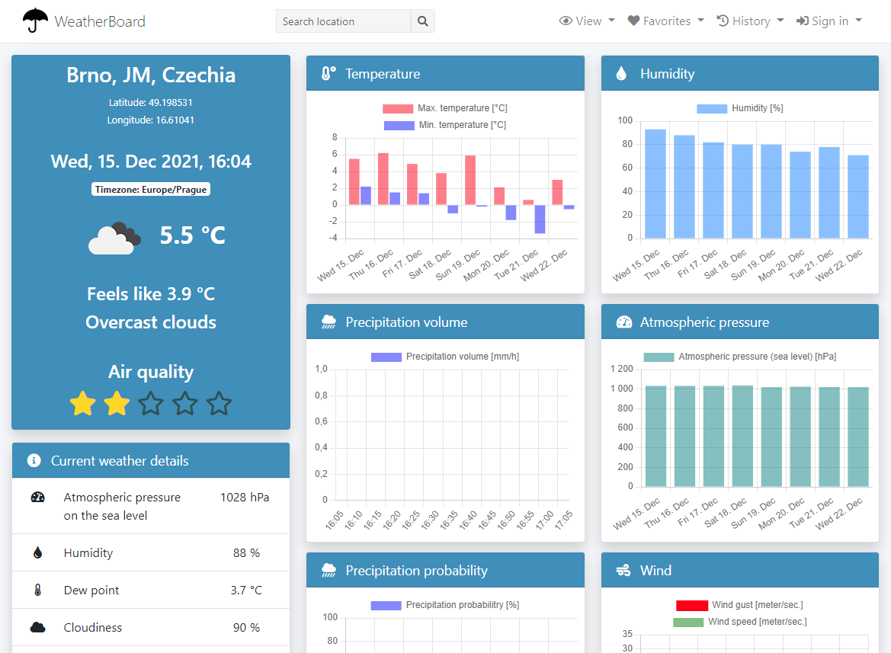

# WeatherBoard

[WeatherBoard](https://jakbude.herokuapp.com) is an experimental weather forecast web application written in [Python](https://www.python.org) using the [Django](https://www.djangoproject.com) web framework. [AdminLTE](https://adminlte.io) and [Bootstrap](https://getbootstrap.com) are used in templates. Charts are rendered using the [Chart.js](https://www.chartjs.org) library. Icons come from [Font Awesome](https://fontawesome.com) and [Bootstrap](https://icons.getbootstrap.com)

WeatherBoard uses weather data from [OpenWeatherMap.org](https://openweathermap.org) and location data from [OpenRouteService.org](https://openrouteservice.org).

If you sign up, WeatherBoard will automatically save every location you visit as long as you stay logged in. WeatherBoard has no direct access to user location.
No personal or other data are stored. 



## Usage
Simply visit [jakbude.herokuapp.com](https://jakbude.herokuapp.com)

## Installation
The result of this installation process will be accessible only on your local computer. Deploying the application to the public internet is out of scope of this document.

### 1. Obtain free API keys

You need to obtain free API keys to access the following data resources (registration required):

* OpenWeatherMap.org
  * [One Call API](https://openweathermap.org/api/one-call-api)
  * [Air Pollution API](https://openweathermap.org/api/air-pollution)
* OpenRouteService.org
  * [Geocode API](https://openrouteservice.org/dev/#/api-docs/geocode/)

### 2. Set up a Python virtual environment

Using a [virtual environment](https://docs.djangoproject.com/en/3.2/howto/windows/#setting-up-a-virtual-environment) is not necessary but highly recommended in order to keep WeatherBoard dependencies isolated from the rest of your system. [Python](https://www.python.org/downloads/) is required, recommended version 3.9.9.

Create virtual environment. On Linux/MacOS type `python3` instead of `python`.
```shell
python -m venv weatherboard_env
```
Activate virtual environment.
```shell
./weatherboard_env/Scripts/activate
```
Since now you should see `(weatherboard_env)` in the beginning of command prompt.

The virtual environment directory should be located outside of the WeatherBoard project directory and should be excluded from versioning (`.gitignore`).

### 3. Download WeatherBoard repository
Using [Git](https://git-scm.com) is not necessary but recommended.

```shell
git clone https://github.com/rvdvorak/weather_board.git
```

Alternatively you can [download](https://github.com/rvdvorak/weather_board/archive/refs/heads/main.zip) the repository as a `.zip` archive.

### 4. Install dependencies
Set working directory to WeatherBoard project root directory:
```shell
cd weather_board
```
Install WeatherBoard dependencies. This may take a while.
On Linux/MacOS type `pip3` instead of `pip`.
```shell
pip install -r ./requirements.txt
```

You should see quite long output similar to this:
```shell
...
...
...
Successfully installed Django-3.2.5 Pillow-8.3.1 asgiref-3.4.1 astroid-2.6.2 autopep8-1.5.7 backports.entry-points-selectable-1.1.0 certifi-2021.5.30 charset-normalizer-2.0.4 colorama-0.4.4 coverage-6.1.2 distlib-0.3.3 dj-database-url-0.5.0 django-appconf-1.0.4 django-compressor-2.4.1 django-heroku-0.3.1 django-sass-processor-1.0.1 filelock-3.3.1 gunicorn-20.1.0 idna-3.2 isort-5.9.2 lazy-object-proxy-1.6.0 libsass-0.21.0 mccabe-0.6.1 mypy-0.910 mypy-extensions-0.4.3 platformdirs-2.4.0 psycopg2-2.9.2 psycopg2-binary-2.9.2 pycodestyle-2.7.0 pylint-2.9.3 python-dotenv-0.19.2 pytz-2021.1 rcssmin-1.0.6 requests-2.26.0 rjsmin-1.1.0 six-1.16.0 sqlparse-0.4.1 toml-0.10.2 typing-extensions-3.10.0.0 urllib3-1.26.6 virtualenv-20.8.1 whitenoise-5.3.0 wrapt-1.12.1
WARNING: You are using pip version 21.2.4; however, version 21.3.1 is available.
You should consider upgrading via the 'C:\DEV\test_weather_board\weatherboard_env\Scripts\python.exe -m pip install --upgrade pip' command.
```

### 5. Set up environment variables
Create a file named `.env` (no extension) in the WeatherBoard project root directory with the following contents:
```
DJANGO_DEBUG=True
FORCE_HTTPS=False
DJANGO_KEY=********
OWM_KEY=********
ORS_KEY=********
```
Replace the ``********`` by the appropriate keys (do NOT use any quotation marks):
* `OWM_KEY` stands for [OpenVeatherMap.org API key](https://home.openweathermap.org/api_keys).
* `ORS_KEY` stands for [OpenRouteService.org API key](https://openrouteservice.org/dev/#/home).
* `DJANGO_KEY` should be 50 characters long (no whitespaces) randomly generated string kept in secret.
* `DJANGO_DEBUG` shows usefull informations for debugging. In production must be set to `False`, otherwise you may expose sensitive informations to hackers.
* `FORCE_HTTPS` redirects all HTTP requests to secure HTTPS connection. This must be `False` on local computer. HTTPS will not work on development server.

**IMPORTANT:**

The file `.env` contains secret keys. Therefore it must be always excluded from publicly available repositories (`.gitignore`).

### 6. Setup the database
Set working directory to `weather_board/weather_project/`.
```shell
cd weather_project
```
Run migrations.
```shell
python manage.py migrate
```
You should see output similar to this:
```shell
Operations to perform:
  Apply all migrations: admin, auth, contenttypes, sessions, weather_app
Running migrations:
  Applying contenttypes.0001_initial... OK
  Applying auth.0001_initial... OK
  Applying admin.0001_initial... OK
  Applying admin.0002_logentry_remove_auto_add... OK
  Applying admin.0003_logentry_add_action_flag_choices... OK
  Applying contenttypes.0002_remove_content_type_name... OK
  Applying auth.0002_alter_permission_name_max_length... OK
  Applying auth.0003_alter_user_email_max_length... OK
  Applying auth.0004_alter_user_username_opts... OK
  Applying auth.0005_alter_user_last_login_null... OK
  Applying auth.0006_require_contenttypes_0002... OK
  Applying auth.0007_alter_validators_add_error_messages... OK
  Applying auth.0008_alter_user_username_max_length... OK
  Applying auth.0009_alter_user_last_name_max_length... OK
  Applying auth.0010_alter_group_name_max_length... OK
  Applying auth.0011_update_proxy_permissions... OK
  Applying auth.0012_alter_user_first_name_max_length... OK
  Applying sessions.0001_initial... OK
  Applying weather_app.0001_initial... OK
  Applying weather_app.0002_auto_20210923_1939... OK
  Applying weather_app.0003_auto_20211003_2259... OK
  Applying weather_app.0004_rename_favorite_location_is_favorite... OK
  Applying weather_app.0005_alter_location_label... OK
  Applying weather_app.0006_auto_20211114_0933... OK
```

### 7. Run tests
Make sure your working directory is set to `weather_board/weather_project/`.

Run tests.
```shell
coverage run manage.py test
```
All tests should pass OK. You should see output similar to this:
```shell
Creating test database for alias 'default'...
System check identified no issues (0 silenced).
...C:\DEV\test_weather_board\weatherboard_env\lib\site-packages\whitenoise\base.py:115: UserWarning: No directory at: C:\DEV\test_weather_board\weather_board\weather_project\staticfiles\
  warnings.warn(u"No directory at: {}".format(root))
.....................................................
----------------------------------------------------------------------
Ran 56 tests in 26.935s

OK
Destroying test database for alias 'default'...
```
Furthermore you may check the coverage by tests.
```shell
coverage report
```

### 8. Run the application (on your local computer)
Make sure your working directory is set to `weather_board/weather_project/`.

Run Django development server locally.
```shell
python manage.py runserver
```
You should see output similar to this:
```shell
Watching for file changes with StatReloader
Performing system checks...

System check identified no issues (0 silenced).
December 15, 2021 - 20:04:15
Django version 3.2.5, using settings 'weather.settings'
Starting development server at http://127.0.0.1:8000/
Quit the server with CTRL-BREAK.
```
Now you should be able to open the WeatherBoard application in your web browser by following the URL printed out in the last screen (`Starting development server at http://127.0.0.1:8000/`). The actual URL may be different on your computer.

# License
WeatherBoard is an open-source project provided under the [MIT License](LICENSE.txt).